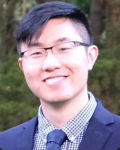

## Welcome to Tony Wu's GitHub page

### About Me

  My name is Tony Wu. During my free time, I enjoy the company of my friends whether we do activities including biking, play basketball, watching movies/shows, and eating. 

  I graduated from The City College of New York back in the Spring of 2020. I decided to serve one year at City Year Americorp. I chose to serve one year because it was an opportunity for me to gain the whole experience of supporting a community and supporting these students in low-income communities. If I get accepted to this program, I will try to connect with my peers and teachers. Furthermore, I’ll try to welcome everyone and make everyone feel more comfortable in the space. 

  I am interested in learning technology because I like technology. The fast-paced advancement of technology has surrounded me throughout my life, which fed my curiosity around it. Technology has improved my life through education and entertainment, which I wish to be a part of. 

### Why you are interested in becoming a TKH Innovation Fellow?

I am interested in the TKH Innovation Fellowship because I believe this program will allow me to learn more about web development and web design. This is a great opportunity to advance my skills in coding and be a part of a community where we value technology and relationship building.  
